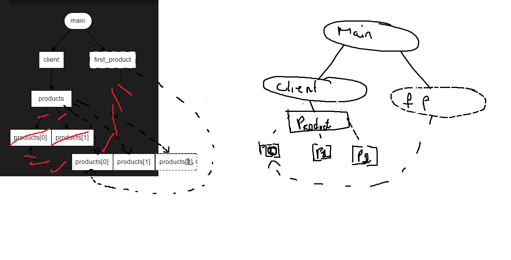

## Exercice 1 - Graphes d'ownership (50min)

```cpp
#include <array>

struct Driver
{};

struct Wheel
{};

struct Car
{
    explicit Car(Driver& d)
    : driver { d }
    {}

    Driver&              driver;
    std::array<Wheel, 4> wheels;
};

int main()
{
    auto driver = Driver {};
    auto car = Car { driver };

    auto& first_wheel = car.wheels.front();
    auto  last_wheel = car.wheels.back();
                                                // <-- on est ici
    return 0;
}
```

> 1. Pourquoi n'y a-t-il pas de relation entre `last_wheel` et `wheels[3]` contrairement à `first_wheel` et `wheels[0]` ?

> il y a pas de relation entre `last_wheel` et `wheels[3]` car `last_wheel` est une copie de `wheels[3]` et non une référence.'

### Cas B - Pointeurs-observants

```cpp
struct Worker;

struct Worker
{
    const Worker* manager = nullptr; 
};

int main()
{
    Worker boss;
    Worker cto;
    Worker technician;

    cto.manager = &boss;
    technician.manager = &cto;
                                    // <-- on est ici
    return 0;
}
```

1. Dans le graphe d'ownership, comment distingue-t-on un pointeur d'une référence ?
2. Comment est représenté un pointeur nul ?
3. En termes de code, quelles sont les deux différences principales entre un pointeur-observant et une référence ?

> 1  les refences sont représenté par des flèches et les pointeurs par des pointillés
> bloc plein fleche pointillé = pointeur observant, et bloc pointillé + fleche pointillé = reference

> il est representé par un rond barré

> les pointeurs peuvent être nuls et peuvent être réaffectés contrairement aux références

### Cas C - Insertions dans un `std::vector`

```cpp
#include <memory>
#include <vector>

struct Product
{};

struct Client
{
    std::vector<Product> products;
};

int main()
{
    auto client = Client {};

    client.products.push_back(Product{});
    client.products.push_back(Product{});

    auto& first_product = client.products.front();
                                                    // <-- on est ici
    client.products.push_back(Product{});
    return 0;
}
```

>Lors d'une insertion, si le buffer mémoire réservé par std::vector n'a pas la place de contenir le nouvel élément, alors le contenu du tableau est réalloué dans un tout nouveau buffer de taille suffisante. Chaque élément est déplacé de son ancienne adresse mémoire vers la nouvelle.
Essayez de représenter les transitions dans le graphe d'ownership après le dernier push_back si celui-ci déclenchait une réallocation mémoire.
Quel problème relève-t-on dans le graphe ?
Modifiez le code ci-dessus afin que products contienne des pointeurs ownants. Pensez à ajouter un destructeur à Client pour libérer la mémoire allouée dynamiquement.
Redessinez le graphe d'ownership de la question 1, mais en prenant en compte vos changements dans le code.
Avez-vous toujours le problème relevé à la question 2 ?

> le problème relevé dans le graphe est que les pointeurs sont invalidés lors de la réallocation mémoire car ils pointent vers des adresses mémoires qui ne sont plus valides. c'est du dangling-reference

```cpp
#include <memory>
#include <vector>

struct Product
{};

struct Client
{
    std::vector<Product> products;
};

int main()
{
    auto client = Client {};

    client.products.push_back(Product{});
    client.products.push_back(Product{});

    auto& first_product = client.products.front();
                                                    // <-- on est ici
    client.products.push_back(Product{});
    return 0;
}


```



> non, car les pointeurs sont maintenant des pointeurs ownants et ne sont pas invalidés lors de la réallocation mémoire.
